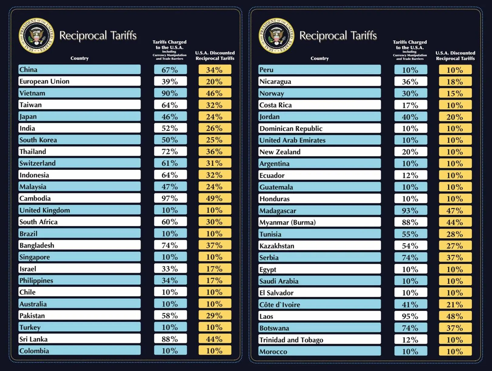

```{r setup, include=FALSE, message=FALSE}
knitr::opts_chunk$set(echo = TRUE)

library(ggplot2)
library(maps)
library(mapdata)
library(dplyr)
library(ggrepel)
```



# Uzasadnienie 
Przedstawiona wizualizacja danych jest zła, ponieważ:  
1. W formie tabelki ciężko jest zobaczyć jakie kolwiek zależność, np.: jaką część świata najdrastyczniej objeły cła.  
2. Ciężko jest zobaczyć, która wartość jest największa bądź najmneijsza.  
3. W mojej opinii tabelka nie zachęca do przeanalizowania danych w porównaniu z mapą.  

```{r mapka, message=FALSE}
w1 <- map_data("world")
tariffs <- read.csv2("tariffs.csv", sep = ",")

tariffs %>% 
  rename("taryfy" = "U.S.A..Discounted.Reciprocal.Tariffs") -> df1
df1$Country[df1$Country == "United Kingdom"] <- "UK"

w1 %>% 
  left_join(df1, by = join_by(region == Country)) -> w2
w2$taryfy[is.na(w2$taryfy)] <- 0.0001

w2 %>% 
  ggplot(aes(x = long, y = lat, group = group, label = region)) + 
  coord_fixed(1.3) +
  geom_polygon(data = w2, aes(fill = taryfy), color = "#D7D7D7") +
  theme_void() +
  scale_fill_fermenter(palette = 5,  direction = 1, n.breaks = 8) +
  labs(title = "Wartość procentowa ceł przez USA",
       subtitle = "na poszczególne kraje w kwietniu 2024",
       fill = "Wartość w %") +
  theme(plot.title = element_text(hjust = 0.5, vjust = 0.5, size = 16),
        plot.subtitle = element_text(hjust = 0.5, vjust = 0.5, size = 12),
        legend.position = "right",
        legend.key.size = unit(1, "cm"))
```
  
# Uzasadnienie
Widzimy odrazu jakich części świata dotyczą cła oraz ich przybliżone wartości procentowe.  