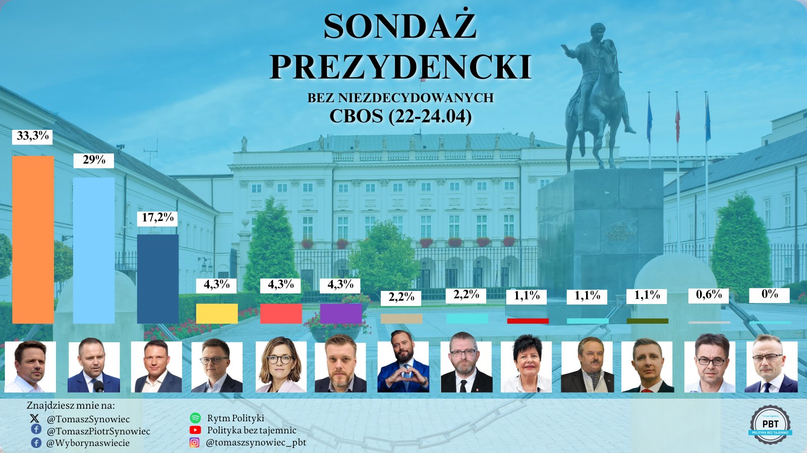
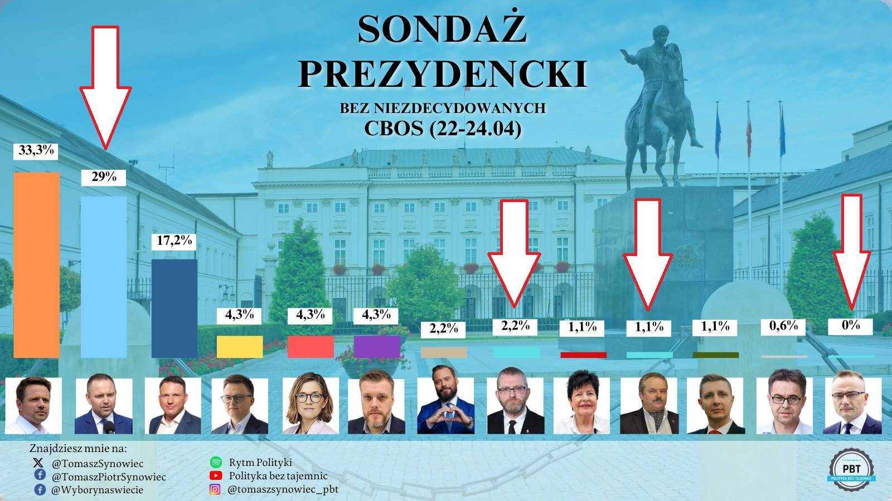
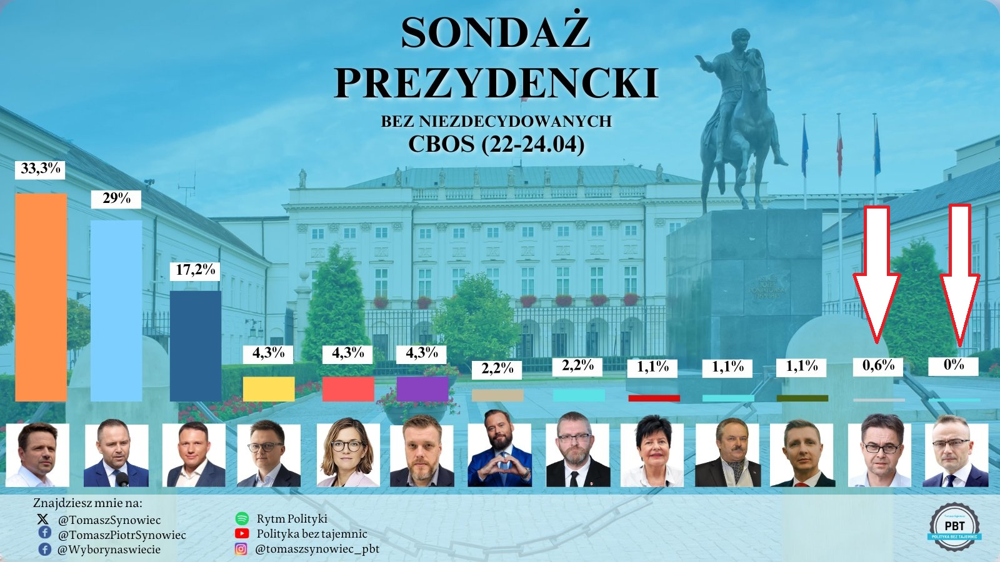
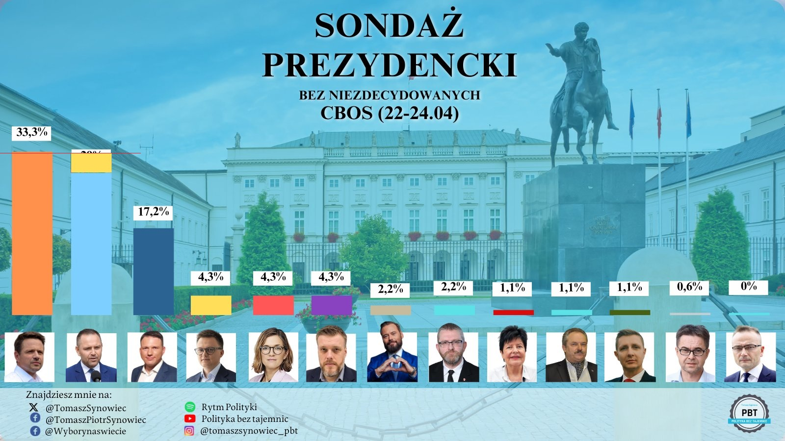

```{r setup, include=FALSE}
knitr::opts_chunk$set(echo = TRUE)
library(ggplot2)

```

## Sondaż prezydencki
#### Sondaż CBOS (22-24.04)

Sondaż znalazłem na Twitterze:

https://x.com/TomaszSynowiec/status/1916847366365237605




## Nieprawidłowości na wykresie
1)  całość nie sumuje się do 100%, po zsumowaniu dostajemy wartość 100.7%

2)  źle dobrane kolory słupków, jasnoniebieskie słupki kandydatów słabo kontrastują z tłem, co utrudnia odczyt




3)  wysokość słupka kandydata mającego 0% poparcia wśród ankietownych jest taka sama jak kandydata z 0.6% poparcia




4) po nałożeniu słupka kandydata mającego 4.3% poparcia, na słupek kandydata mającego 29% poparcia, otrzymamy słupek niższy niż kandydata mającego 33.3% poparcia





## Nowa wizualizacja

```{r pressure, echo=TRUE}
x<- c(33.3, 29, 17.2, 4.3, 4.3, 4.3, 2.2, 2.2, 1.1, 1.1, 1.1, 0.6, 0)
y<- c("Trzaskowski", "Nawrocki", "Mentzen", "Hołownia", "Biejat", "Zandberg","Stanowski", "Braun","Senyszyn", "Jakubiak", "Bartoszewicz", "Maciak", "Woch")
df <- data.frame(x, y)

ggplot(df, aes(x = reorder(y, -x), y = x)) +
  geom_bar(stat = "identity", fill = "steelblue", ) +
  geom_text(aes(label = paste(x, "%")), vjust = -0.5, size = 3.5) +
  labs(x = "Kandydat", y = "Procent poparcia", title = "Sondaż prezydencki", subtitle = "CBOS 22.04.2025 - 24.04.2025") +
  theme_minimal() +
  theme(axis.text.x = element_text(angle = 45, hjust = 1))+
  scale_y_continuous(breaks = seq(0, 35, by = 3))

```

Nie zmieniałem danych, więc nadal całość nie sumuje się do 100%, ale niebieski kolor słupków na białym tle wpływa na lepszy odczyt danych. Kandydat, który ma 0% poparcia wreszcie ma słupek wysokości 0, a wysokości słupków są proporcjonalne względem siebie.
