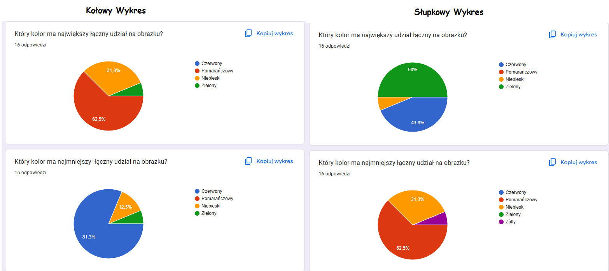
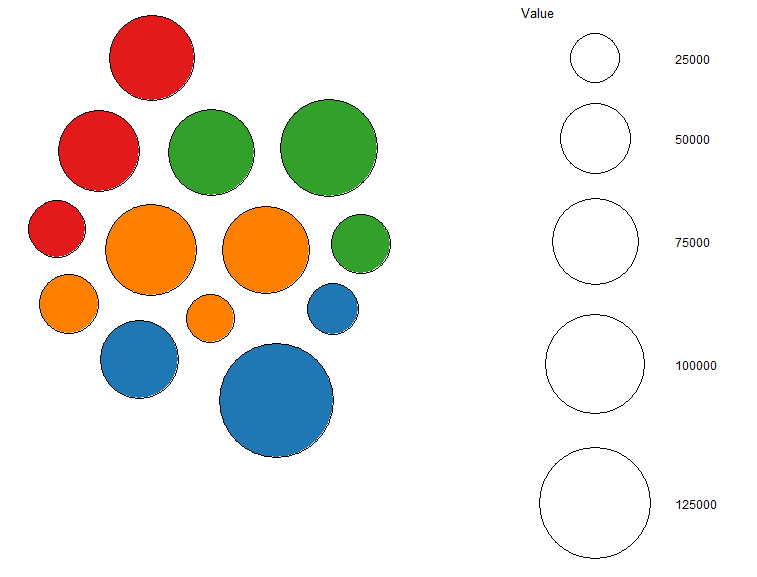

```{r setup, include=FALSE}
knitr::opts_chunk$set(echo = TRUE)
```

#Percepcja pola (bubble chart) vs długości (bar chart)


# Cel
Eksperyment będzie polegał na sprawdzeniu, którą formę prezentacji danych jest lepiej odczytywana przez odbiorce.
Sprawdzenie, jak różni się zdolność do:
  
- identyfikacji kategorii o największym łącznym udziale (pola kolorowych kręgów vs długości słupków),

- precyzyjnej estymacji wartości największej,
gdy dane prezentowane są jako wykres bąbelkowy (bubble chart) lub klasyczny wykres słupkowy.

# Porównanie wielkości grup na dwóch wykresach

```{r, echo=FALSE, message=FALSE, warning=FALSE}
#dane zmyslone na potrzeby eksperymentu
library(packcircles)
library(ggplot2)
library(ggrepel)
library(scales)

# wykres bubble chart
df <- data.frame(
  product = c("Caffe Mocha", "Decaf Espresso", "Regular Espresso",
              "Chamomile", "Lemon", "Mint",
              "Amaretto", "Colombian", "Decaf Irish Cream", "Caffe Latte",
              "Green Tea", "Earl Grey", "Darjeeling"),
  value = c(84904, 78162, 24031,
            75578, 95926, 35710,
            26269,128311, 62248, 35899,
            32850, 66772, 73151),
  type = c("Espresso","Espresso","Espresso",
           "Herbal Tea","Herbal Tea","Herbal Tea",
           "Coffee","Coffee","Coffee","Espresso",
           "Tea","Tea","Tea"),
  stringsAsFactors = FALSE
)

packing <- circleProgressiveLayout(df$value, sizetype = "area")
packing$id <- seq_len(nrow(packing))
df_packed <- cbind(df, packing)
dat.gg <- circleLayoutVertices(packing, npoints = 100)
dat.gg <- merge(dat.gg, df_packed[, c("id", "type")], by = "id")
pal <- c(
  "Coffee"     = "#1f78b4",
  "Espresso"   = "#ff7f00",
  "Herbal Tea" = "#33a02c",
  "Tea"        = "#e31a1c"
)

p_bubble <- ggplot() +
  geom_polygon(data = dat.gg,
               aes(x, y, group = id, fill = type),
               colour = "black", alpha = 1) +
  scale_fill_manual(values = pal) +
  coord_equal() +
  theme_void() +
  theme(legend.title = element_blank(),
        legend.position = "top") +
  ggtitle("Bubble chart")

print(p_bubble)


# wykres bar chart


df <- data.frame(
  product = c("Caffe Mocha", "Decaf Espresso", "Regular Espresso",
              "Chamomile", "Lemon", "Mint",
              "Amaretto", "Colombian", "Decaf Irish Cream", "Caffe Latte",
              "Green Tea", "Earl Grey", "Darjeeling"),
  value = c(26863, 55084, 31427,
            120788, 73377, 54937,
            34116, 129904, 25000, 69692,
            90281, 93704, 63541),
  type = c("Espresso","Espresso","Espresso",
           "Herbal Tea","Herbal Tea","Herbal Tea",
           "Coffee","Coffee","Coffee","Espresso",
           "Tea","Tea","Tea"),
  stringsAsFactors = FALSE
)

pal <- c(
  "Coffee"     = "#1f78b4",
  "Espresso"   = "#ff7f00",
  "Herbal Tea" = "#33a02c",
  "Tea"        = "#e31a1c"
)

p_bar <- ggplot(df, aes(x = reorder(product, value), y = value, fill = type)) +
  geom_col(color = "black", width = 0.7) +
  scale_fill_manual(values = pal) +
  scale_y_continuous(labels = comma) +
  coord_flip() +
  labs(x = NULL, y = "Value",
       title = "Bar chart") +
  theme_minimal() +
  theme(
    legend.title    = element_blank(),
    legend.position = "top",
    plot.title      = element_text(hjust = 0.5)
  )

print(p_bar)

```

# Wnioski 1 
  W przypadku znalezienia grupy mającej największy i najmniejszy udział na wykresie ankietowani wskazali poprawnnie kategorię dla kołowych 62,5% dla najwiekszej i 83 % dla najmniejszej
  Gdzie dla słupkowych jest to 50% dla najwiekszej i 62,5% dla najmnieszych. Z tego wynika że dla danej grupy badawczej pole jest łatwiejsze do porównania całych kategorii. Mimo to 75% badanych woli wykres słupkowy i uznaje go za bardziej profesjonalny.
  
```{r obrazek, echo=FALSE, fig.cap="(Kolory dobrał Google)"}

```
  
# Odczytanie Największej wartości
```{r pressure, echo=FALSE}

# wykres bąbelkowy nie wiem czemu jest tak blisko bo jak pisałem w samym R to działało dobrze  

df <- data.frame(
  product = c("Caffe Mocha", "Decaf Espresso", "Regular Espresso",
              "Chamomile", "Lemon", "Mint",
              "Amaretto", "Colombian", "Decaf Irish Cream", "Caffe Latte",
              "Green Tea", "Earl Grey", "Darjeeling"),
  value = c(84904, 78162, 24031,
            75578, 95926, 35710,
            26269,132311, 62248, 35899,
            32850, 66772, 73151),
  type = c("Espresso","Espresso","Espresso",
           "Herbal Tea","Herbal Tea","Herbal Tea",
           "Coffee","Coffee","Coffee","Espresso",
           "Tea","Tea","Tea"),
  stringsAsFactors = FALSE
)

packing <- circleProgressiveLayout(df$value, sizetype = "area")
packing$id <- seq_len(nrow(packing))
df_packed <- cbind(df, packing)
dat.gg <- circleLayoutVertices(packing, npoints = 100)
dat.gg <- merge(dat.gg, df_packed[, c("id", "type")], by = "id")

# 5. Rysujemy wykres bańkowy ----
pal <- c(
  "Coffee"     = "#1f78b4",
  "Espresso"   = "#ff7f00",
  "Herbal Tea" = "#33a02c",
  "Tea"        = "#e31a1c"
)

p_bubble_point <- ggplot(df_packed, aes(x = x, y = y)) +
  geom_point(aes(size = value, fill = type),
             shape = 21, colour = "black", alpha = 1) +
  scale_fill_manual(name   = "Type",
                    values = pal) +
  scale_size_area(name     = "Value",
                  max_size = 40) +       
  scale_x_continuous(expand = expansion(mult = 0.5)) +
  scale_y_continuous(expand = expansion(mult = 0.5)) +
  coord_equal() +
  theme_void() +
  theme(
    legend.position = "right",
    legend.title    = element_text(size = 10),
    plot.title      = element_text(hjust = 0.5)
  ) +
  ggtitle("Bubble chart")

#print(p_bubble_point) nie wiem czemu tutaj mi brzydko wypisuje w samym R dobrze dzialalo ://


df <- data.frame(
  product = c("Caffe Mocha", "Decaf Espresso", "Regular Espresso",
              "Chamomile", "Lemon", "Mint",
              "Amaretto", "Colombian", "Decaf Irish Cream", "Caffe Latte",
              "Green Tea", "Earl Grey", "Darjeeling"),
  value = c(26863, 55084, 31427,
            120788, 73377, 54937,
            34116, 129904, 25000, 69692,
            90281, 93704, 63541),
  type = c("Espresso","Espresso","Espresso",
           "Herbal Tea","Herbal Tea","Herbal Tea",
           "Coffee","Coffee","Coffee","Espresso",
           "Tea","Tea","Tea"),
  stringsAsFactors = FALSE
)

pal <- c(
  "Coffee"     = "#1f78b4",
  "Espresso"   = "#ff7f00",
  "Herbal Tea" = "#33a02c",
  "Tea"        = "#e31a1c"
)

p_bar <- ggplot(df, aes(x = reorder(product, value), y = value, fill = type)) +
  geom_col(color = "black", width = 0.7) +
  scale_fill_manual(values = pal) +
  scale_y_continuous(labels = comma) +
  coord_flip() +
  labs(x = NULL, y = "Value",
       title = "Bar chart") +
  theme_minimal() +
  theme(
    legend.title    = element_blank(),
    legend.position = "top",
    plot.title      = element_text(hjust = 0.5)
  )

print(p_bar)

```
  
```{r obrazek2, echo=FALSE, fig.cap="kol"}

```
# Wnioski 2
  Tutaj przy zadaniu odczytania największej wartości wyjawia się duża przewaga słupkowego gdzie średni wynik ankietowanych rózni się jedynie o niecały 1% gdzie przy babęlkowym różni się aż o 15%.
   
# Podsumowanie
  Wyniki badań pokazują że do dokładnej analizy danych w której zależy nam na wartościach, wykres słupkowy jest dużo lepszy jednak jeżeli chodzi nam o kategorie które mają kilka wartości to żeby porównywać kategorie między sobą warto rozważyć wykres bąbelkowy.
  
Link do ankiety: https://forms.gle/nbxq5Vo89Uq6gLND8
