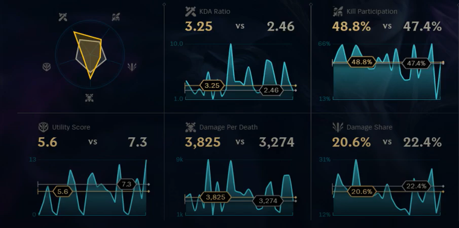

```{r setup, include=FALSE}
knitr::opts_chunk$set(echo = TRUE)
```

# Wstęp i opis eksperymentu

  Wykresy typu spider chart są często krytykowane przez ekspertów w dziedzinie wizualizacji danych z wielu względów. Ciężko z nich szybko odczytać dokładne wartości, zwłaszcza gdy porównujemy wiele obiektów jednocześnie. Linie i obszary mogą się na siebie nakładać, tworząc wizualny chaos, który utrudnia interpretację. Dodatkowo, ludzie mają naturalne trudności z porównywaniem długości promieni rozchodzących się od wspólnego środka w różnych kierunkach — znacznie trudniej to ocenić niż przykładowo długość słupków. Mimo to spider charty pozostają popularne, szczególnie w grach komputerowych, gdzie prezentują statystyki postaci w estetycznej formie.

# Przykłady
```{r obrazek, echo=FALSE, fig.cap="Statystyki gracza w League of Legends"}

```

```{r obrazek2, echo=FALSE, fig.cap="Statystyki pokémona w Pokémon Let's Go Pikachu"}
knitr::include_graphics("Pokemon-Lets-Go-Stats.jpg")
```

# Cel
  Eksperyment będzie polegał na sprawdzeniu, którą formę prezentacji danych preferują osoby niezajmujące się na co dzień wizualizacją informacji. Uczestnicy badania zostaną poproszeni o ocenę wykresów przedstawiających te same dane w dwóch różnych formach: wykresie spider chart oraz w bardziej klasycznej i czytelnej formie, takiej jak wykres typu lollipop. Celem eksperymentu będzie ustalenie, czy estetyka i przyzwyczajenia wizualne przeważają nad klarownością przekazu, czy też użytkownicy intuicyjnie wybierają formy bardziej zgodne z zasadami efektywnej wizualizacji danych. Wyniki pozwolą ocenić, czy dawne dobre praktyki projektowania wykresów pozostają skuteczne w odbiorze współczesnych użytkowników. 

# Porównanie dwóch statystyk na jednym wykresie
  Wykresy na podstawie danych na temat pokémonów (z labów)
```{r, echo=FALSE, message=FALSE, warning=FALSE}

pokemon <- read.csv("https://raw.githubusercontent.com/mini-pw/2021Z-DataVisualizationTechniques/master/labs/data/Pokemon.csv")[,-1]

library(ggradar)
library(dplyr)
library(scales)
library(ggplot2)
library(tibble)
library(fmsb)
library(tidyr)
library(gridExtra)

# Select two Pokémon
selected <- pokemon[pokemon$Name %in% c("Charizard", "Poliwrath"),
                 c("Name", "HP", "Attack", "Defense", "Sp..Atk", "Sp..Def", "Speed")]

# Clean column names
colnames(selected) <- gsub("\\.\\.", ".", colnames(selected))

# Set row names and remove Name column
rownames(selected) <- selected$Name
selected$Name <- NULL

# Add required max and min rows for radarchart
stats_max <- rep(125, 6)
stats_min <- rep(0, 6)
radar_data <- rbind(stats_max, stats_min, selected)

# Define polygon colors
colors_border <- c("tomato", "dodgerblue")
colors_fill <- adjustcolor(colors_border, alpha.f = 0.3)

# Set up larger margins (right side) to accommodate legend
par(mar = c(2, 2, 4, 8))  # Increased right margin from 6 to 8

# Create the radar chart
radarchart(radar_data,
           axistype = 1,
           pcol = colors_border,
           pfcol = colors_fill,
           plwd = 2,
           cglcol = "grey30",
           cglty = 1,
           cglwd = 0.8,
           axislabcol = "black",
           caxislabels = seq(0, 125, 25),
           vlcex = 0.9,
           title = "Pokémon Stats Comparison")

# Add compact legend that fits
legend(x = 1.2, y = 1.2,  # Position outside plot area
       legend = rownames(radar_data)[3:4],
       bty = "n",          # No box
       pch = 15,           # Square symbols
       col = colors_border,
       pt.cex = 1.2,       # Slightly smaller symbols
       xpd = TRUE,         # Allow drawing outside plot
       title = "Pokémon",
       title.adj = 0.2)


selected <- selected %>%
  tibble::rownames_to_column("Pokemon")


plot_data <- selected %>%
  pivot_longer(-Pokemon, names_to = "Stat", values_to = "Value") %>%
  group_by(Stat) %>%
  mutate(Difference = diff(Value)) %>%
  ungroup() %>%
  mutate(Stat = factor(Stat, levels = colnames(selected)[-1]))

ggplot(plot_data, aes(x = Stat, y = Value, group = Stat)) +
  # Background grid lines
  geom_hline(
    yintercept = seq(0, 125, 25),
    color = "gray90", 
    linewidth = 0.5
  ) +
  # Connecting lines
  geom_line(
    color = "gray70", 
    linewidth = 1.5, 
    alpha = 0.7
  ) +
  # Points
  geom_point(
    aes(color = Pokemon), 
    size = 4,
    show.legend = TRUE
  ) +
  scale_color_manual(
    values = c("Charizard" = "#FF6B6B", "Poliwrath" = "#4E79C7"),
    guide = guide_legend(title = NULL)
  ) +
  # Fixed y-axis scale
  scale_y_continuous(
    limits = c(0, 125),
    breaks = seq(0, 125, 25),
    expand = c(0, 0)  # No extra padding
  ) +
  labs(
    title = "Pokémon Stat Comparison",
    subtitle = "Charizard vs Poliwrath",
    x = NULL,
    y = NULL
  ) +
  theme_minimal(base_size = 14) +
  theme(
    axis.text.x = element_text(
      angle = 30, 
      hjust = 1,
      face = "bold",
      size = 12
    ),
    panel.grid.major.x = element_blank(),
    panel.grid.minor = element_blank(),
    plot.title = element_text(
      hjust = 0.5,
      face = "bold",
      size = 16,
      margin = margin(b = 8)
    ),
    plot.subtitle = element_text(
      hjust = 0.5,
      color = "gray40",
      margin = margin(b = 15)
    ),
    legend.position = "top",
    legend.text = element_text(size = 12)
  )


```

# Wnioski 1 
  W przypadku porównywania dwóch wartości na jednym wykresie zdania ankietowanych są podzielone. Wśród badanych 56% osób uznała, że porównywanie danych na wykrescie radarowym pozwala im na szybsze zobczenie, który z pokémonów przewyższa drugiego w danej statystyce, ale tylko 18% uznało, że może z niego dokładniej oszacować poszczególne różnice. Zdecydowana większość ankietowanych - aż 68% stwierdziła, że wykres radarowy w tym przypadku jest bardziej estetyczny. Ponad połowa - 56% uważa, że sposób przedstawienia danych w wykresie radarowym utrudniła im ocene różnic między Pokémonami. Paradoksalnie tyle samo osób uznało ten wykres za bardziej profesjonalny.
  
# Przedstawienie statystyk jednego pokémona
```{r pressure, echo=FALSE}
# 1. RADAR CHART FOR PIKACHU
# Prepare data
pikachu_data <- pokemon[pokemon$Name == "Pikachu", 
                      c("HP", "Attack", "Defense", "Sp..Atk", "Sp..Def", "Speed")]
colnames(pikachu_data) <- gsub("\\.\\.", ".", colnames(pikachu_data))

# Add max/min rows
stats_max <- rep(100, 6)
stats_min <- rep(0, 6)
radar_data <- rbind(stats_max, stats_min, pikachu_data)

# Create radar chart
par(mar = c(2, 2, 4, 2))
radarchart(radar_data,
           axistype = 1,
           axislabcol = "black",
           pcol = "#FFD700",  # Pikachu yellow
           pfcol = adjustcolor("#FFD700", alpha.f = 0.3),
           plwd = 2,
           title = "Pikachu Stats Radar Chart",
           caxislabels = seq(0, 100, 25))

# Prepare data in long format
pikachu_long <- pikachu_data %>%
  tibble::rownames_to_column("Pokemon") %>%
  pivot_longer(-Pokemon, names_to = "Stat", values_to = "Value")


ggplot(pikachu_long, aes(x = Stat, y = Value)) +
  # Bars in Pikachu yellow
  geom_col(fill = "#FFD700", width = 0.6) +

  # Add grid lines for reference
  geom_hline(yintercept = seq(0, 100, 25), color = "grey90", linewidth = 0.3) +
  
  # Proper scaling
  scale_y_continuous(limits = c(0, 100),
                     breaks = seq(0, 100, 25),
                     expand = expansion(mult = c(0, 0.05))) +  # Minimal headroom
  
  # Clean labeling
  labs(title = "Pikachu Base Stats Distribution",
       x = NULL,
       y = "Stat Value") +
  
  # Minimalist theme
  theme_minimal(base_size = 12) +
  theme(
    panel.grid.major.x = element_blank(),
    panel.grid.minor.y = element_blank(),
    axis.text.x = element_text(face = "bold"),
    plot.title = element_text(face = "bold", hjust = 0.5),
    plot.subtitle = element_text(hjust = 0.5, color = "grey40", size = 10),
    plot.margin = margin(10, 10, 10, 10)
  )

```

# Wnioski 2
   W przypadku odczytywania jednej wartości ankietowani zdecydowanie preferują wykres słupkowy. W każdym pytaniu dotyczącym czytelności 93% odpowiedzi preferowało wykresy słupkowe. Zaledwie 25% osób uznało wykres słupkowy za mniej profesjonalny za jego minimalistyczną formę.
   
# Podsumowanie
  Wyniki badania potwierdzają postawioną tezę – choć wykresy typu spider chart wyglądają efektownie i cieszą się popularnością, to nie sprawdzają się najlepiej tam, gdzie liczy się dokładność i czytelność danych. Ich forma, choć estetyczna, często utrudnia szybkie porównywanie wartości i może wprowadzać zamieszanie. Tradycyjniejsze formy wizualizacji, takie jak wykresy słupkowe, okazują się zna bardziej przejrzyste i intuicyjne, szczególnie gdy celem jest jasne pokazanie różnic między wartościami. Pokazuje to, że atrakcyjna forma graficzna nie zawsze idzie w parze z funkcjonalnością, a przy projektowaniu wykresów warto kierować się nie tylko wyglądem, ale przede wszystkim łatwością odbioru informacji.
  
Link do ankiety: https://forms.gle/myRvAQfqenNfMnnV8
