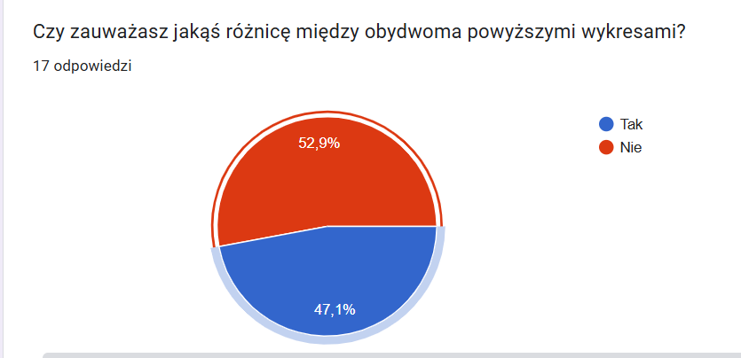
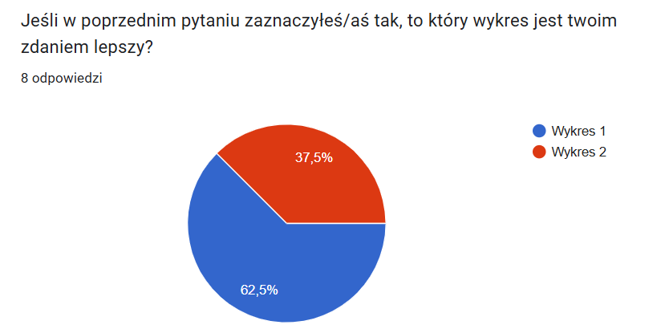

```{r setup, include=FALSE}
knitr::opts_chunk$set(echo = TRUE)
library(dplyr)
library(ggplot2)
library(RColorBrewer)
setwd("D:/Studia/4 semest/Eksploracja/HW5")
df <- read.csv("kobebryant.csv")
```

## Eksperyment 1 

W pierwszym mini-eksperymencie chciałem sprawdzić czy osoby które nie zajmują się analizą danych i nie mają doświadczenia z tworzeniem wykresów zauważą czy na wykresie są tak zwane "latające słupki". Wykonałem dwa takie same wykresy w których na jednym występuje ten problem, a na drugim nie.

```{r}
df %>% 
  filter(minutes_played!="Null" & !is.na(points)) %>% 
  mutate(points = as.integer(points)) %>% 
  group_by(opponent) %>% 
  summarise(max = max(points, na.rm = TRUE)) %>% 
  arrange(-max) %>% 
  ggplot(aes(x = reorder(opponent, max), y = max)) +
  geom_col(fill = "#9A348E") +
  theme_minimal() +
  theme(
    axis.text.x = element_text(angle = 90, color = "black"),
    plot.title = element_text(size = 11, hjust = 0.5),
    plot.background = element_rect(fill = "#F7B801", color = NA)
  ) +
  labs(
    title = "Maksymalna liczba punktów zdobyta przez Kobiego Bryanta przeciwko każdej drużynie",
    x = "Drużyny",
    y = "Punkty"
    ) 

df %>% 
  filter(minutes_played!="Null" & !is.na(points)) %>% 
  mutate(points = as.integer(points)) %>% 
  group_by(opponent) %>% 
  summarise(max = max(points, na.rm = TRUE)) %>% 
  arrange(-max) %>% 
  ggplot(aes(x = reorder(opponent, max), y = max)) +
  geom_col(fill = "#9A348E") +
  theme_minimal() +
  scale_y_continuous(expand=c(0,0)) +
  theme(
    axis.text.x = element_text(angle = 90, color = "black"),
    plot.title = element_text(size = 11, hjust = 0.5),
    plot.background = element_rect(fill = "#F7B801", color = NA)
  ) +
  labs(
    title = "Maksymalna liczba punktów zdobyta przez Kobiego Bryanta przeciwko każdej drużynie",
    x = "Drużyny",
    y = "Punkty"
  ) 

```

## Wynik eksperymentu 1

Po części zgodnie z moimi przewidywaniami nie wszyscy zauważali różnicę na tych dwóch wykresach, gdy były one przedstawione jeden pod drugim. Jednak ku mojemy zaskoczeniu większość osób które zauważyły różnicę i tak uważały że wykres na którym są "latające słupki" jest lepszy niż ten teoretycznie poprawny bez nich.





## Eksperyment 2

W tym eksperymencie badałem czy używanie zbyt dużej ilości kolorów powoduje że wykres staje się mniej czytelny i przez to nie będzie preferowany przez osoby które go oglądają.

```{r, echo=FALSE}
team_cols <- c(
  # Pacific / Southwest
  "phoenix suns"              = "#E56020",  # orange
  "los angeles clippers"      = "#ED174C",  # red
  "golden state warriors"     = "#1D428A",  # royal blue
  "sacramento kings"          = "#5A2D81",  # purple
  "dallas mavericks"          = "#00538C",  # navy
  "houston rockets"           = "#CE1141",  # red
  "san antonio spurs"         = "#C4CED4",  # silver/grey
  
  # Northwest
  "minnesota timberwolves"    = "#0C2340",  # midnight blue
  "utah jazz"                 = "#002B5C",  # navy
  "denver nuggets"            = "#0E2240",  # midnight blue
  "seattle supersonics"       = "#00653A",  # forest green (retro)
  "portland trailbrazers"     = "#E03A3E",  # red
  "oklahoma city thunder"     = "#007AC1",  # thunder blue
  "memphis grizzlies"         = "#5D76A9",  # beale street blue
  "vancouver grizzlies"       = "#00B2A9",  # turquoise (retro)
  
  # Atlantic
  "new york knicks"           = "#006BB6",  # blue
  "toronto rapters"           = "#CE1141",  # red (Raptors)
  "philadelphia 76ers"        = "#006BB6",  # blue
  "boston celtics"            = "#007A33",  # kelly green
  "brooklyn nets"             = "#000000",  # black
  "new jersey nets"           = "#003DA5",  # dark blue (retro)
  
  # Central / Midwest
  "chicago bulls"             = "#CE1141",  # red
  "cleveland cavaliers"       = "#6F263D",  # wine
  "detroit pistons"           = "#C8102E",  # red
  "milwaukee bucks"           = "#00471B",  # green
  "indian pacers"             = "#002D62",  # navy
  
  # Southeast
  "charlotte hornets"         = "#00788C",  # teal
  "atlanta hawks"             = "#E03A3E",  # hawks red
  "miami heat"                = "#98002E",  # red
  "orlando magic"             = "#0077C0",  # magic blue
  "washington wizards"        = "#002B5C",  # navy
  "washington bullets"        = "#E31837",  # bullets red (retro)
  
  # Others / historical
  "sacramento kings"          = "#5A2D81",  # (already above)
  "new orleans pelicans"      = "#0C2340",  # navy
  "new orleans/oklahoma city" = "#007AC1",  # teal‑blue hybrid (Katrina era Hornets)
  "phoenix suns"              = "#E56020"   # (dup‑safe)
)
```


```{r}
df %>% 
  filter(minutes_played!="Null" & !is.na(points)) %>% 
  mutate(points = as.integer(points)) %>% 
  group_by(opponent) %>% 
  summarise(max = max(points, na.rm = TRUE)) %>% 
  arrange(-max) %>% 
  ggplot(aes(x = reorder(opponent, max), y = max)) +
  geom_col(fill="darkblue") +
  theme_minimal() +
  scale_y_continuous(expand=c(0,0)) +
  theme(
    axis.text.x = element_text(angle = 90, color = "black"),
    plot.title = element_text(size = 11, hjust = 0.5),
    legend.title = element_blank(),
    legend.text = element_blank(),
    legend.position = "none",
  ) +
  labs(
    title = "Maksymalna liczba punktów zdobyta przez Kobiego Bryanta przeciwko każdej drużynie",
    x = "Drużyny",
    y = "Punkty"
  ) 

df %>% 
  filter(minutes_played!="Null" & !is.na(points)) %>% 
  mutate(points = as.integer(points)) %>% 
  group_by(opponent) %>% 
  summarise(max = max(points, na.rm = TRUE)) %>% 
  arrange(-max) %>% 
  ggplot(aes(x = reorder(opponent, max), y = max, fill = opponent)) +
  geom_col() +
  theme_minimal() +
  scale_y_continuous(expand=c(0,0)) +
  scale_fill_manual(values = team_cols) +
  theme(
    axis.text.x = element_text(angle = 90, color = "black"),
    plot.title = element_text(size = 11, hjust = 0.5),
    legend.title = element_blank(),
    legend.text = element_blank(),
    legend.position = "none",
  ) +
  labs(
    title = "Maksymalna liczba punktów zdobyta przez Kobiego Bryanta przeciwko każdej drużynie",
    x = "Drużyny",
    y = "Punkty"
  ) 


```


## Wynik eksperymentu 2 

Zgodnie z dobrą praktyką tworzenia wykresów, wykres na którym każda drużyna została podwójnie oznaczona kolorem oraz podpisem na osi X nie był preferowany przez osoby ankietowane. Użycie kolorów które reprezentowały barwy klubów nie miało żadnego pozytywnego wpływu i większość ankietowanych wybrała wykres na których wszystkie słupki były w jednym kolorze.

