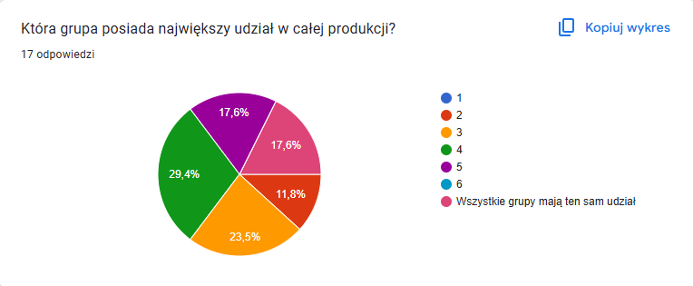
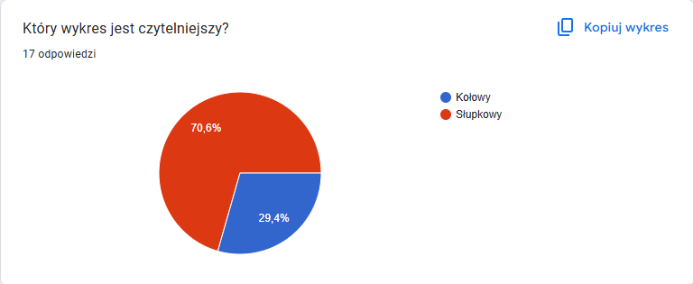

```{r setup, include=FALSE, message=FALSE}
knitr::opts_chunk$set(echo = TRUE)
library(dplyr)
library(ggplot2)
```

# Wykorzystane dane (wymyślone na potrzeby eksperymentu)
```{r, message=FALSE}
data <- data.frame(grupa = c("gr. 1", "gr. 2", "gr. 3", "gr. 4", "gr. 5", "gr. 6"),
                   wartosc = c(15.5, 17, 16.5, 17.8, 17.2, 16))
```

## Wykres kołowy
```{r, message=FALSE}
data <- data %>% 
  arrange(desc(grupa)) %>%
  mutate(prop = wartosc / sum(data$wartosc) *100) %>%
  mutate(ypos = cumsum(prop)- 0.5*prop )

ggplot(data, aes(x="", y=wartosc, fill=grupa)) +
  geom_bar(stat="identity", width=1) +
  coord_polar("y") +
  theme_void() +
  theme(legend.position="none") +
  geom_text(aes(y=ypos, label=grupa), color="white", size=4) +
  scale_fill_brewer(palette="Set2") +
  labs(title = "Udział poszczególnych grup w produkcji") +
  theme(plot.title = element_text(hjust=0.5))
```

## Wykres słupkowy
```{r, message=FALSE}
ggplot(data, aes(x=grupa, y=wartosc)) +
  geom_col(fill="#fc9272") +
  labs(y = "udział [%]",
       title = "Udział poszczególnych grup w produkcji") +
  theme_minimal()

```


# Opis eksperymentu
Celem przeprowadzanego badania było sprawdzenie, czy problem z odczytywaniem danych przedstawionych na wykresie kołowym rzeczywiście istnieje. W tym celu utworzona została ankieta zawierająca dwa pytania. Respondentom przedstawiono wykres kołowy przedstawiony powyżej oraz zostali oni poproszeni o wskazanie grupy, której udział wśród całej produkcji jest największy. Następnie, pokazano im wykres słupkowy, ukazujący te same dane, oraz postawiono pytanie, który z obu wykresów jest ich zdaniem czytelniejszy.

# Wyniki
## Pytanie 1: która grupa ma największy udział w całej produkcji?


## Pytanie 2: który wykres jest czytelniejszy?


# Wnioski i podsumowanie
Eksperyment potwierdza powszechne przekonanie o problemie porównywania bliskich sobie wartości na wykresie kołowym. Tylko 29,4% respondentów udzieliło poprawnej odpowiedzi w pytaniu pierwszym, co dobitnie ukazuje wspomnianą wadę tego typu wizualizacji danych. Ponadto, taki sam procent osób odpowiadających w ankiecie również wskazał wykres kołowy jako ten bardziej czytelny. Wyniki zatem wskazują na wyższość wizualizacji za pomocą wykresu słupkowego, co potwierdza słuszność "dobrych praktyk" opracowanych lata temu.
