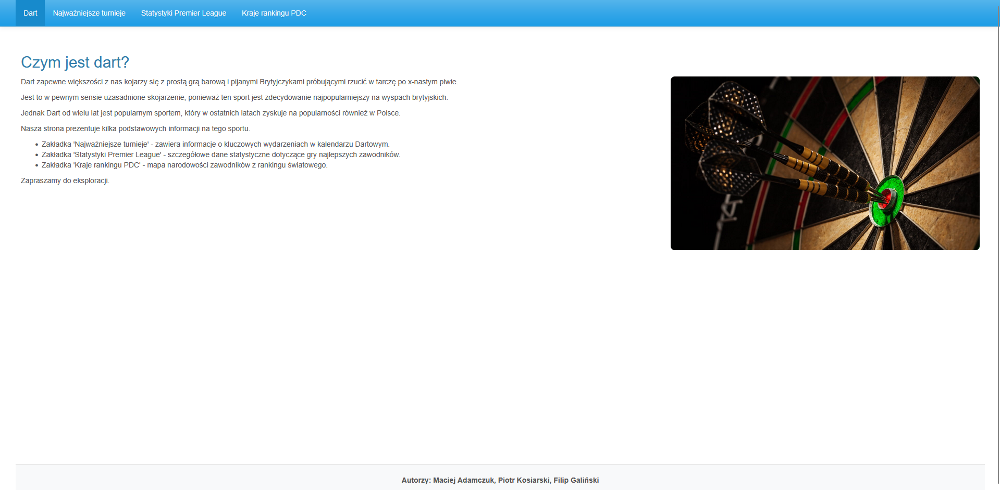
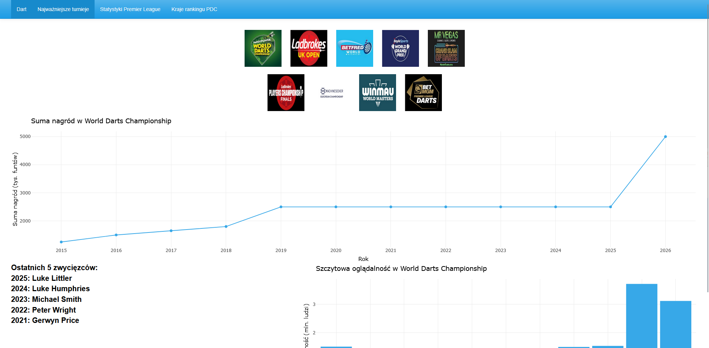
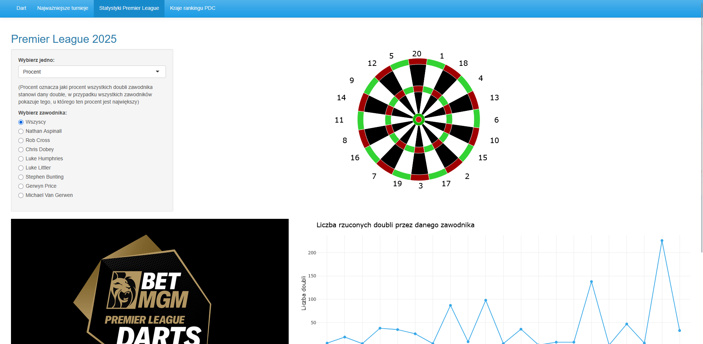
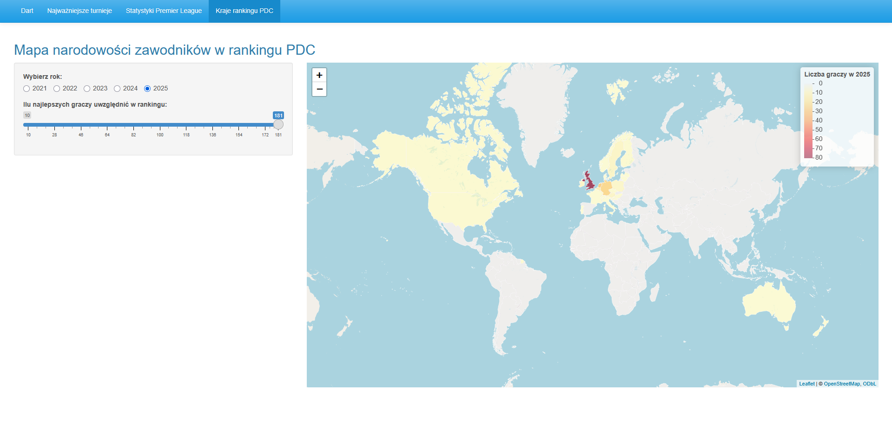

Aplikacja uruchamiana jest przez plik index.R. Aplikacja zawiera stronę główną z krótkim opisem oraz 3 podstrony zawierające interaktywne wykresy. Pierwszy z nich dostępny w zakładce Najważniejsze Turnieje przedstawia dane dotyczące 9 turniejów rankingowych PDC. Po naciśnięciu na logo danego turnieju przedstawia się wykres dotyczący zmiany sumy nagród w ostatnich latach, oraz lista 5 ostatnich zwycięzców. Dodatkowo w sekcji poświęconej Mistrzostwom Świata jest dodatkowy wykres przedstawiający zmianę szczytowej oglądalności. W zakładce Statystyki Premier League znajduje się wykres przedstawiony na tarczy do rzutek, który przedstawia który gracz najczęściej kończył legi danym doublem (po wybraniu ilość), lub u którego gracza dany double stanowi największy procent zakończeń (Procent). Dodatkowo można zmienić dane na podgląd tylko jednego konkretnego gracza. Poniżej znajduje się również wykres przedstawiający rozłożenie doubli na wykresie liniowym. Dodatkowo na stronie znajduje się również zdjęcie gracza (lub logo turnieju) z krótkim opisem. Ostatnia zakładka "Kraje Rankingu PDC" Przedstawia interaktywną mapę, na którą nałożeni zostali najlepsi gracze z rankingu PDC w danym roku. Interaktywność mapy polega na tym, że można wybrać rok, który zostanie przedstawiony na mapie, oraz to ilu topowych zawodników powinno zostać na niej przedstawionych.

