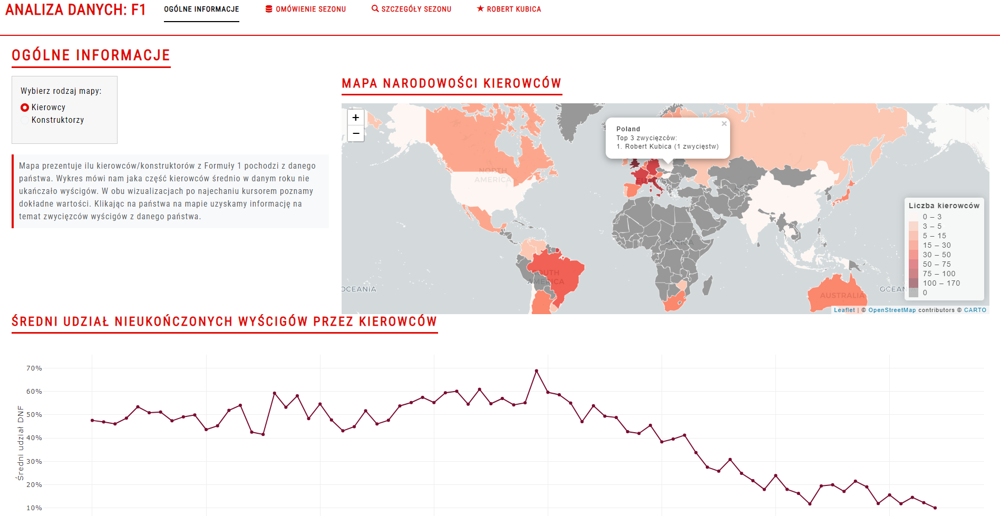
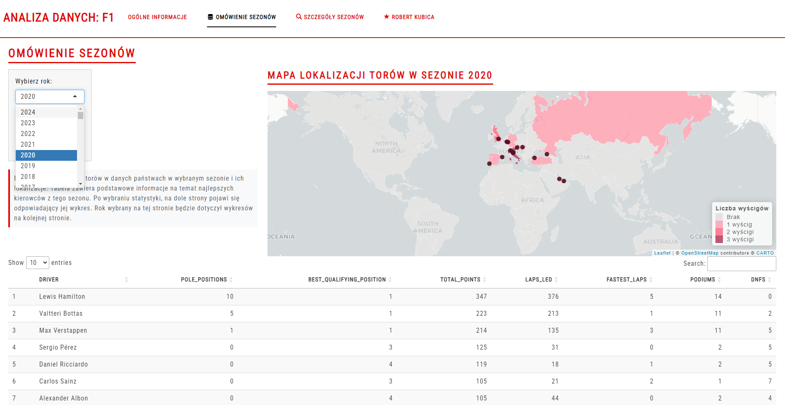
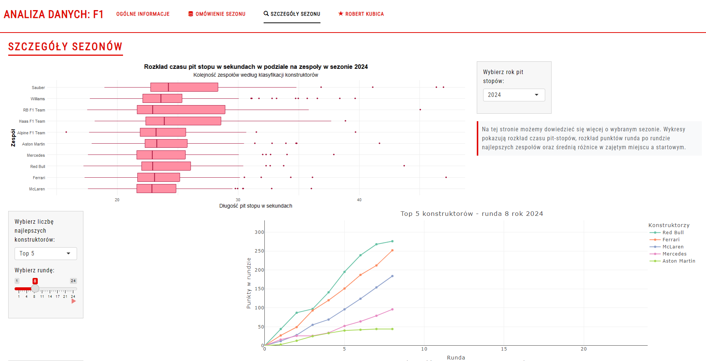

# F1 Dashboard

## Opis projektu

Interaktywna aplikacja Shiny prezentująca dane i statystyki związane z Formułą 1. Zawiera wizualizacje dotyczące kierowców, konstruktorów, torów wyścigowych, sezonów oraz kariery Roberta Kubicy.

---

## Strona 1: Ogólne informacje

Mapa prezetuje ilu kierowców/konstruktorów z Formuły 1 pochodzi z danego państwa.
Wykres mówi nam jaka część kierowców średnio w danym roku nie ukańczało wyścigów.
W obu wizualizacjach po najechaniu kursorem poznamy dokładne wartości.
Klikając na państwa na mapie uzyskamy informację na temat zwycięzców wyścigów z danego państwa.

---

## Strona 2: Omówienie sezonów

Mapa prezentuje liczbę torów w danych państwach w wybranym sezonie i ich lokalizacje.
Tabela zawiera podstawowe informacje na temat najlepszych kierowców z tego sezonu.
Po wybraniu statystyki, na dole strony pojawi się odpowiadający jej wykres.

---

## Strona 3: Szczegóły sezonów

Na tej stronie możemy dowiedzieć się więcej o wybranym sezonie.
Wykresy pokazują rozkład czasu pit-stopów, rozkład punktów runda po rundzie najlepszych zespołów oraz średnią różnice w zajętym miejscu a startowym.

---

## Strona 4: Kariera Roberta Kubicy

Możemy zobaczyć statystyki jedynego polskiego kierowcy w Formule 1.
W wybranym sezonie pokazujemy zajęte przez niego miejsca 
oraz w latach kiedy jeździł porównanie jego wyników z jego kolegą z zespołu.

---
## Autorzy

Maria Brzósko, Michał Grzegory, Maciej Barańczyk

---
## Źródło Danych

https://www.kaggle.com/datasets/rohanrao/formula-1-world-championship-1950-2020?select=drivers.csv