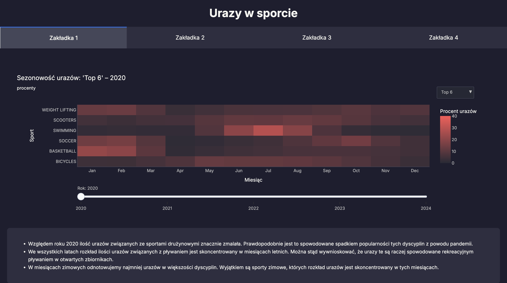

# Projekt II - raport końcowy

## Tematyka
Pierwotnie chcieliśmy zająć się kontuzjami i dopingiem w profesjonalnym sporcie, jednak szybko okazało się, że dane na te tematy nie są łatwo dostępne. Zajęliśmy się więc urazami w sporcie, ale niekoniecznie profesjonalnym.

## Dane
Dane pochodzą ze strony [NEISS](https://www.cpsc.gov) (która akurat nie do końca działa). Organizacja ta zbiera dane o urazach w podziale na konkretne produkty / kategorie produktów. Po pobraniu danych związaliśmy więc konkretne produkty z dyscyplinami sportu, w ten sposób otrzymując dane o urazach w poszczególnych sportach. Dane pobierane były latami (2020-2024) w oddzielnych plikach i scalone i przygotowane za pomocą kodu z pliku `preprocessing.py`. W sumie otrzymaliśmy około 500k wierszy. Plik `dane.xlsx`, który powinien być umieszczony w głównym folderze projektu można pobrać [tu](https://docs.google.com/spreadsheets/d/1F061KgUP9PNPDPeVtE5GOTYLvJh3P66u/edit?usp=sharing&ouid=103077581190578222119&rtpof=true&sd=true).

## Dashboard

Wszystkie funkcje tworzące wykresy z dashboardu są w pliku `plots.py`. Plik `app.py` odpowiada za działanie aplikacji, a `style.css` za wygląd.

Aplikacja została podzielona tematycznie na cztery sekcje. Wygląda to następująco:

Każda zakładka zawiera dwa wykresy wraz z krótkimi opisami i wnioskami. 
