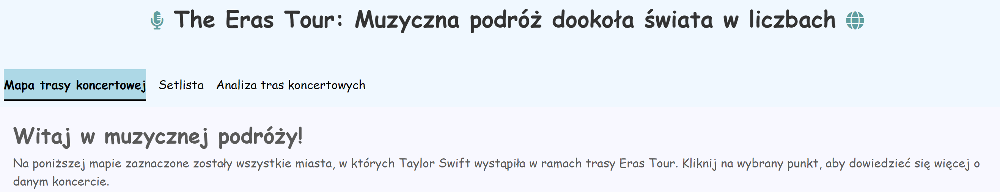
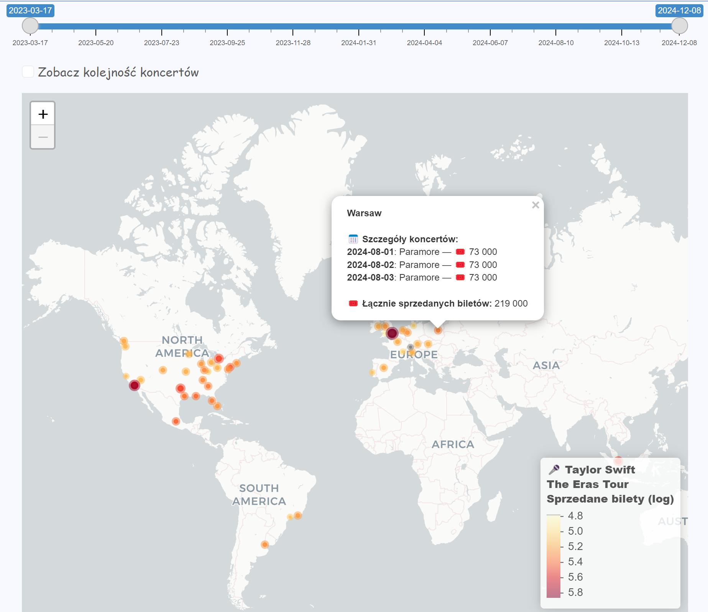
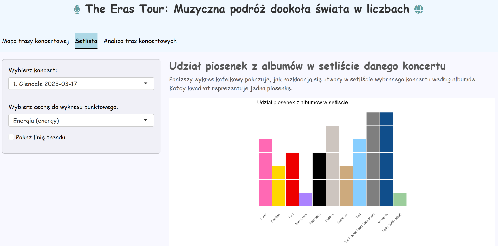
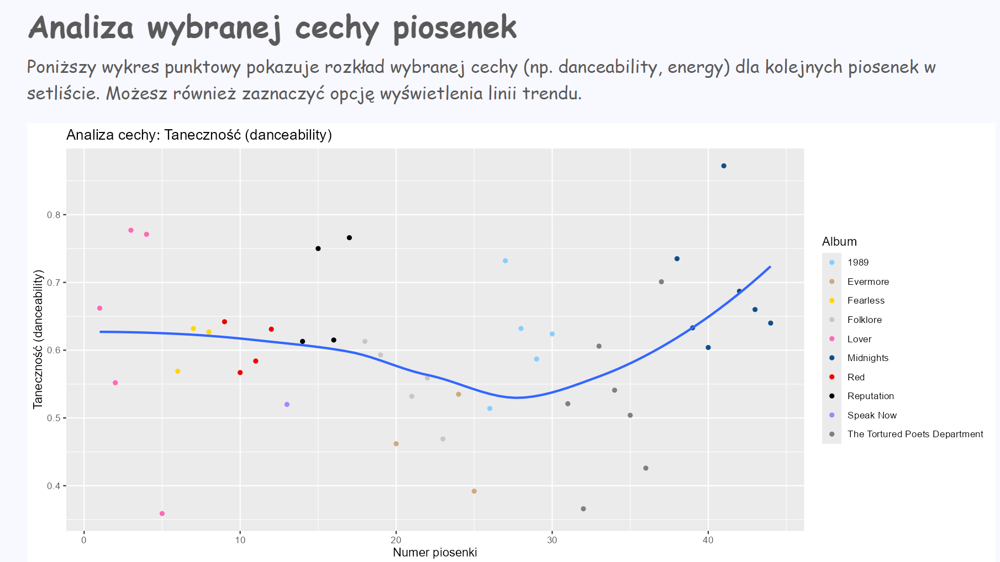
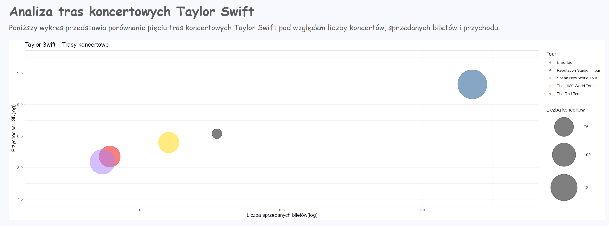

# The Eras Tour 
Autorzy: Barbara Jankowska, Gerard Mańkowski, Krystian Kaliś

## 🎯 Cel projektu

Celem projektu było przeanalizowanie trasy koncertowej *The Eras Tour* Taylor Swift pod względem:

- lokalizacji koncertów i liczby sprzedanych biletów,
- zestawienia setlist,
- analizy cech piosenek,
- porównania względem poprzednich tras koncertowych Taylor Swift. 

---

## 📊 Wykorzystane dane

Zebrane dane pochodziły z następujących źródeł:

- https://www.kaggle.com/datasets/yukawithdata/taylor-swift-the-eras-tour-official-setlist-data
- https://www.kaggle.com/datasets/tymonbot/taylor-swift-eras-toure
- https://en.wikipedia.org/wiki/Reputation_Stadium_Tour#Records
- https://touringdata.wordpress.com/2023/11/19/taylor-swift-1989-tour/
- https://en.wikipedia.org/wiki/Speak_Now_World_Tour
- https://en.wikipedia.org/wiki/The_Red_Tour
- https://time.com/7199590/taylor-swift-eras-tour-final-numbers/

---
## 📅 Wstęp
 
Po otwarciu aplikacji, widzimy okno startowe wprowadzające nas w zamysł projektu.

W pasku u góry znajdują się 3 główne zakładki
- Mapa trasy koncertowej
- Setlista
- Analiza tras koncertowych

## 🌍 Zakres trasy

Przedstawiono mapę, która prezentuje kolejność koncertów. Możemy z niej wywnioskować w których miastach odbyły się koncerty, ile biletów zostało sprzedanych podczas każdego z nich oraz kiedy odbyły się koncerty w danym mieście.

---

## 🎵 Udział piosenek w setliście

W tej części ukazano waffle chart pokazujący jakie piosenki zostały zaśpiewane przez Taylor Swift podczas danego koncertu. Możemy odczytać które albumy były "faworyzowane", czyli z których albumów Taylor zaśpiewała najwięcej utworów danego dnia trasy

---

## 🎶 Analiza setlisty

Przeanalizowano każdą piosenkę z głównej setlisty pod względem wybranych cech. Wśród nich uwzględnione zostały: energia, taneczność, pozytywność, akustyczność, zawartość mowy, tempo, głośność i długość utworu. Do każdej spośród analizowanych cech można dodać linię trendu 

---

## 💰️ Porównanie tras koncertowych

Porównano ze sobą trasy koncertowe: The Eras Tour, Reputation, Speak Now, 1989 i Red Tour. Analizowane wielkości to: liczba sprzedanych biletów, przychód oraz liczba koncertów. The eras tour pod każdym względem wyróżnia się wobec pozostałych.

---