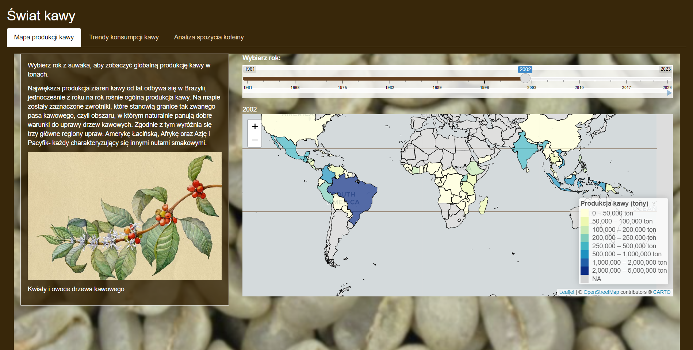
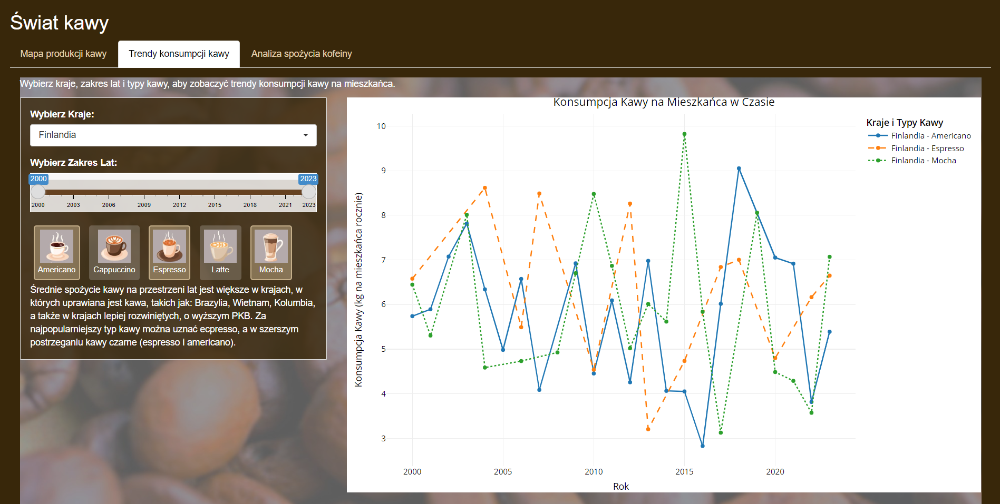
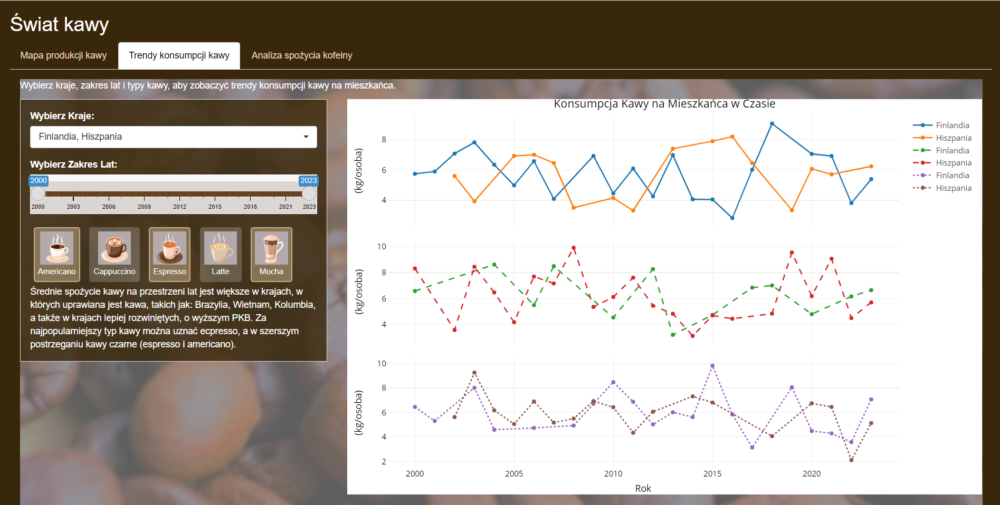
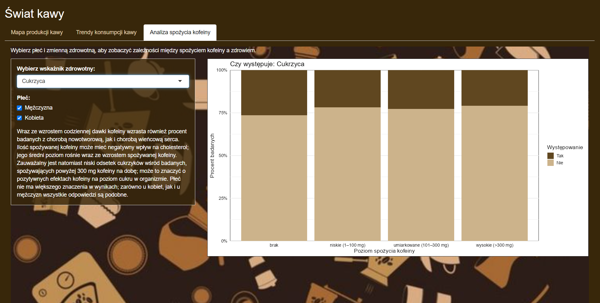

# Świat kawy

Projekt ma na celu przedstawienie i wzualację informacji powiązanych z kawą. Przedstawia historię od upraw i zbiorów, przez prefenrecje spożycia aż do możliwych konsekwencji zdrowotnych spożywania kofeiny.

## Zakładka 1: Mapa produkcji kawy

Interaktywna mapa pokazuje globalną produkcję zielonych ziaren kawy w tonach dla wybranego roku oraz zmiany tej produkcj, a także zależność upraw od położenia kraju.

## Zakładka 2: Trendy konsumpcji kawy

Przedstawienie popularności sześciu typów napojów na bazie kawy dla różnych państw świata w celu porówania spożycia między różnymi krajami bazując na wykresach dla danego przedziału czasowego (a także ogólnej wiedzy o państwach).

 

## Zakładka 3: Analiza spożycia kofeiny

Przedstawienie zależności występowania wybranych chorób a ilości spożywanej kofeiny z możliwym podziałem na płcie jako przedstawienie (nie tylko negatynego) wpływu kawy na zdrowie.

## Wnioski

Projekt umożliwia łatwą i intuicyjną analizę danych o produkcji kawy na świecie. Dzięki interaktywnym elementom, takim jak mapa i suwak wyboru roku, użytkownik może szybko uzyskać wgląd w trendy i różnice w produkcji kawy między krajami.

## Autorki

Olga Kachniewska, Julia Pińkowska, Michalina Woźnica
