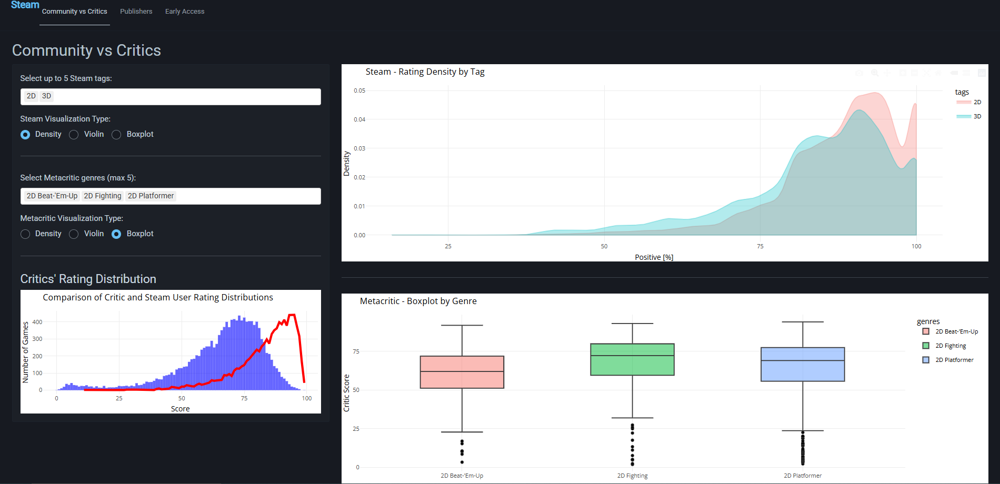
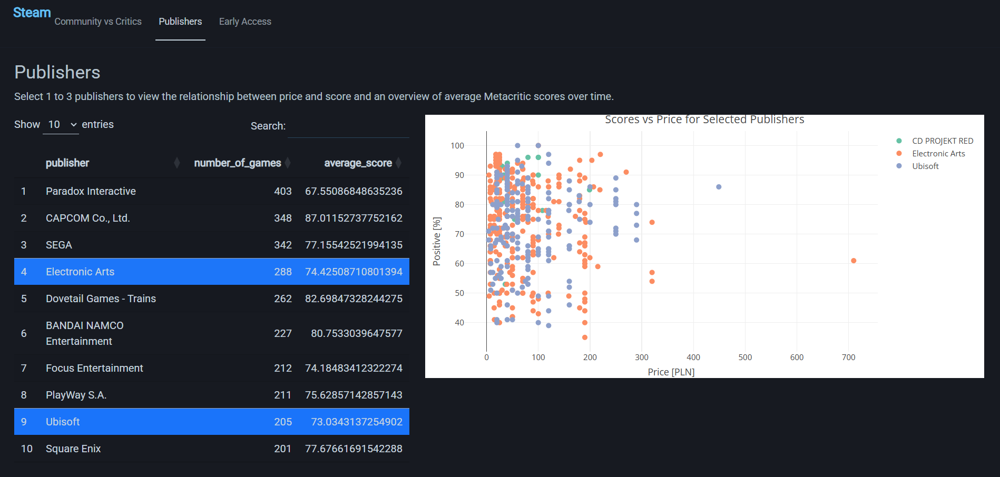
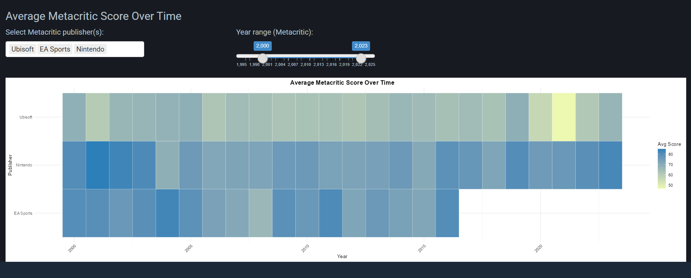
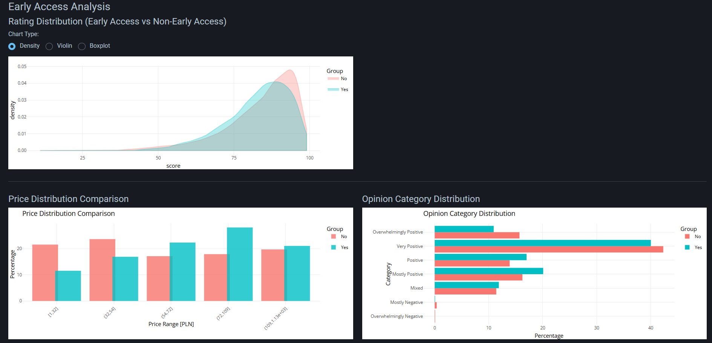

# 🎮 Steam vs Metacritic — Interaktywna Analiza Gier

## 📊 Opis Aplikacji

Interaktywna aplikacja Shiny analizująca dane z platform Steam i Metacritic. Umożliwia porównanie opinii społeczności graczy z ocenami krytyków, analizę wydawców oraz wpływu Early Access na jakość gier.

### 📁 Źródła Danych

-   **Steam** – dane dotyczące ocen użytkowników, cen, tagów, wydawców itp.
-   **Metacritic** – dane o ocenach krytyków, gatunkach i wydawcach.

Szczegóły dotyczące danych: <https://github.com/youngopos/WED_Projekt2/tree/main/Dane>

------------------------------------------------------------------------

## 🧩 Funkcjonalności

### Zakładka: *Community vs Critics*

-   Porównanie rozkładów ocen Steam i Metacritic.
-   Wizualizacje typu: Density, Violin, Boxplot.
-   Wybór tagów (Steam) i gatunków (Metacritic).
-   Bezpośrednie porównanie rozkładów ocen użytkowników i krytyków.

### Zakładka: *Publishers*

-   Interaktywny wybór wydawców Steam.
-   Zależność między ceną a oceną gier danego wydawcy.
-   Średnie oceny Metacritic w czasie w formie mapy cieplnej (heatmapy).

### Zakładka: *Early Access*

-   Porównanie ocen i cen gier w wersji Early Access vs. pełne wydania.
-   Rozkład kategorii opinii (np. Overwhelmingly Positive).
-   Średnie oceny gier w czasie (2020–2024) z podziałem na status Early Access.

](5.png)
