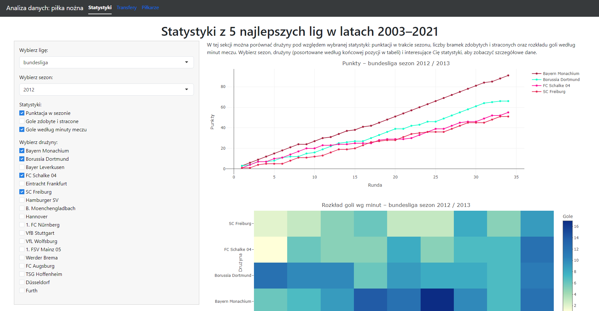

# Analiza danych w piłce nożnej

### Cel projektu:
Aplikacja ma na celu umożliwienie samodzielnej analizy niektórych ciekawych aspektów piłki nożnej oraz tego, jak się one zmieniały na przestrzeni kolejnych sezonów.

### Zawartość:
Aplikacja została podzielona na 3 sekcje:

- Statystyki - w tej części można porównać liczby punktów danej drużyny na przestrzeni sezonu, liczby zdobytych i straconych bramek oraz rozkład goli według minuty meczu.

- Transfery - sekcja poświęcona transferom pod względem ilościowym (w najlepszych 5 europejskich ligach), czyli liczbie wykonanych transferów i łącznego przepływu pieniędzy pomiędzy ligami w danym sezonie.

- Piłkarze - porównywanie najbardziej wartościowych piłkarzy w wybranych ligach i/lub drużynach.

### Zrzut ekranu - przykładowe użycie aplikacji:
