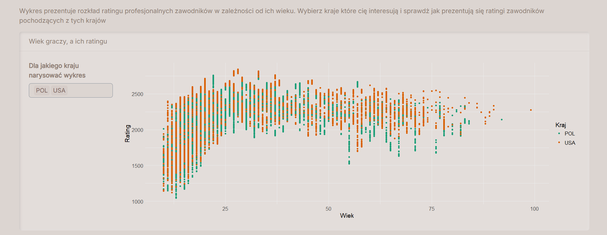

# Analiza Partii Szachowych
#### Daniel Zawadzki, Jakub Tywonek, Dominik Wilk  

Nasz projekt dotyczy analizy zarówno dużych zbiorów partii szachowych, jak i tych partii, które sami rozegraliśmy. 
Dane o partiach pobraliśmy z głównych portali internetowych z szachami online.
Przeanalizowaliśmy, która strona, czarne czy białe, wygrywaja częściej oraz czy wpływ na to ma ranking graczy oraz czas partii. Również przeanalizowaliśmy zależność między rankingiem topowych graczy a czynnikami takimi jak wiek oraz płeć.
Analizę naszych rankingów podzieliliśmy na typ partii oraz pokazaliśmy jak nasze rankingi zmieniały się w czasie. 

#### Źródła danych:  
openingtree.com

Chess.com

Lichess.org

Zrzuty ekranu z naszej aplikacji:

### Dane
Poniżej znajduje się też link do dysku na którym znajdują się wszystkie dane, niestety nie udało nam się ich dodać na githuba ponieważ były zbyt duże.
https://drive.google.com/drive/folders/1swyLLjSYflykknQbkV6Ih_CYszgSQixs?usp=sharing

Dane powinny się znaleźć w folderze "dane" aby kod dobrze się wywoływał.